<h1 align="center"> Práctica Califica 3 </h1>

## Principio de responsabilidad única (Sofía Poma)

* **Pregunta 1 Muestra la salida y explica los resultados en función de los métodos entregados**

> 


> En principio se tienen 2 clases, la clase Cliente y la clase Estudiante.
>Al momento de ejecutar el código, se llama al “main” que se encuentra en la clase Cliente. Comienza por imprimir que haremos una demostración sin SRP, luego se instancia un objeto de la clase Empleado, llamando a su constructor el cual se le pasará el nombre, apellido y los años de experiencia. Llamamos al método showEmpDetail de la clase Cliente,  al cual le pasamos por parámetro el objeto Empleado instanciado. Este método hace uso del objeto pasado como parámetro llamando al método displayEmpDetail, el cual imprime el nombre, apellido y los años de experiencia del empleado. A continuación imprime el ID del empleado llamando al método generateEmpId de la clase Empleado, al cual se le pasa por parámetro el nombre del empleado con la finalidad de que nos genere el ID del empleado concatenado la primera letra de su nombre con un número entero random menor que 1000 para así pasar a imprimirlo. Después, se imprime el nivel laboral del empleado llamando al método checkSenior de la clase Empleado, al cual se le pasa por parámetro los años de experiencia del empleado con la finalidad de que evalúe que si los años de experiencia son mayores a 5 entonces será de senior, caso contrario será un junior. Continuando con el main, hace un impresión de un separador denotado por simbolos “-”, para luego volver a instanciar otro objeto de tipo Empleado pasándole sus respectivos datos para finalmente volver a llamar al método displayEmpDetail, el cual ya ha sido detallado anteriormente. Concluyendo así la ejecución del programa.

* **Pregunta 2 ¿Cuál es el problema con este diseño y las razones posibles del problema?**

>El problema con este diseño es que viola el principio de responsabilidad única ya que como se puede observar la clase Empleado tiene 3 responsabilidades distintas, el método displayEmpDetail(), el método checkSeniority, el método generateEmpId, cada una de estos métodos tiene diferentes finalidades lo que provoca un alto acoplamiento y una baja cohesión, lo que hace que nuestro diseño sea frágil. Si quisiéramos, por ejemplo, imprimir los detalles del empleado de manera distinta, no podríamos debido a que solo contamos con un método print. Otro problema sería que si quisiéramos testear el método que verifica la experiencia en años del empleado, estamos obligados a testear los otros métodos también. Es por esto que una posible solución es mover este método a una sola clase la cual se encargará de tener todos los métodos de impresión.

* **Pregunta 3 Modifica la clase Empleado. Agrega dos clases SeniorityChecker que contiene el método checkSeniority() y la clase GeneradorIDEmpleado contiene el método generateEmpId(...) para generar la identificación del empleado. Para mejorar la legibilidad del código y evitar torpezas dentro del método main(), utiliza el método estático showEmpDetail(...). Este método llama al método displayEmpDetail() de Empleado, al método generateEmpId() de GeneradorIDEmpleado y al método checkSeniority() de SeniorityChecker. Tú entiendes que este método no era necesario, pero hace que el código del cliente sea simple y fácilmente comprensible.**

>Código de la clase Cliente
>

>Código de la clase Empleado
>

>Código de la clase GeneradoIDEmpleado
>

>Código de la clase SeniorityChecker
>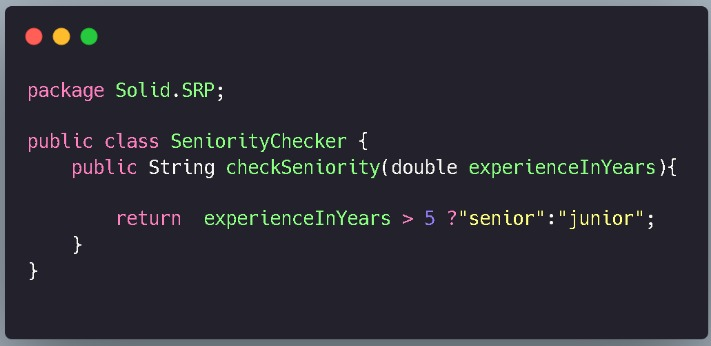

* **Pregunta 4 Realiza una demostración completa que sigue a SRP. Explica tus resultados**
        Empleado.java

        GeneradorIdEmpleado.java

        SeniorityChecker.java

        Cliente.java

>

>La clase Cliente tiene el método main en el cuál se instancia un objeto de la clase Empleado y se llama al método showEmpDetail()
>La clase Empleado tiene al método displayEmpDetail() el cual nos mostrará el nombre y el tiempo de experiencia del empleado.
>La clase SeniorityChecker, tiene el método checkSeniority el cuál haciendo uso del atributo experienceInYears evaluará si los años de experiencia del empleado son suficientes para considerarlo junior o senior, será considerado senior si los años de experiencia son mayores a 5 años.
>La clase GeneradorIdEmpleado tiene el método generateEmpId nos generará aleatoriamente el Id del empleado concatenando la primera letra de su nombre con un número aleatorio entre 1000 números enteros.


## Principio abierto/cerrado (Bruno Cipriano)
* **Pregunta 5 ¿Por que no es correcto colocar displayResult() y evaluateDistinction() en la misma clase, como la siguiente:**

    class Estudiante {

        // ....

        public void displayResult() {

        // codigo

        }

        public void evaluateDistinction() {

        // codigo

        }

        // ...

    }

**Sean los siguientes archivos:**

Estudiante.java

DistinctionDecider.java

Cliente.java

>En el caso de que hubiera modificaciones o se quisiera extender los requerimientos, la clase Estudiante se vería siempre expuesta a modificaciones. Por ejemplo, aumentar más tipos de departamentos de los que hay, pues solo necesitamos modificar la lista de departamentos, ya que el método evaluateDistiction hace uso de ella, pero al estar todo en la misma clase Estudiante, esta sería la más expuesta aunque no se quisiera cambiar nada del método displayResult violando así el principio Open/Closed.
>En el caso del testing, al tener estas clases separadas, nos ayudará a no tener que modificar sus respectivos tests cada vez que se mejore o amplíe dicho código. Además, al tener 2 métodos que hacen cosas muy diferentes en una sola clase, estaría violando el principio de responsabilidad única.

* **Pregunta 6 Muestra la salida y explica los resultados en función de los métodos entregados**

>En principio se llama al método enrollStudents() la cual tiene como propósito instanciar objetos de tipo Estudiante, definiendo su nombre, código de registro y calificación. Luego estas instancias las almacena en un lista la cual al final retorna.

>Para imprimir los resultados se hace uso de un bucle “for” el cual recorre cada uno de los elementos de la lista  Estudiantes para  luego “imprimirlos”. El software sabe como imprimir este objeto debido a que la clase Estudiante cuenta con el método sobrescrito “toString()” el cual retorna la manera en que se debe mostrar en pantalla los atributos o datos de dicho objeto.

>El método evaluateDistinction  evaluará primero al tipo de departamento al que pertenece el estudiante y de acuerdo a eso procederá a evaluar si el estudiante tiene el puntaje suficiente para recibir una distinción en el tipo de departamento al que pertenece, en el caso que pertenezca al departamento de Ciencias necesitará tener un puntaje mayor a 80 si desea recibir una distinción; si pertenece al departamento de Arte, necesitará tener un puntaje mayor a 70.

>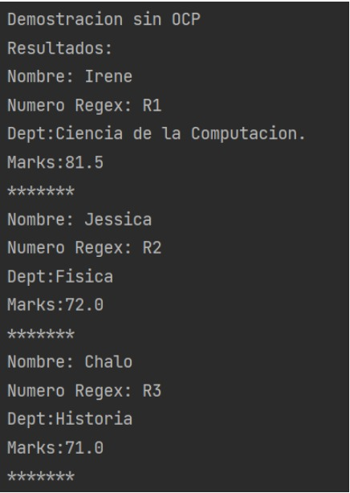

>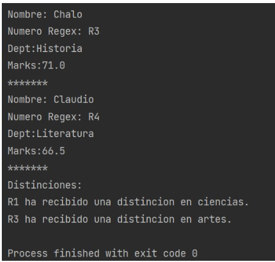

* **Pregunta 7 ¿Cuál es el problema con este diseño y las razones posibles del problema?**

>El problema con este diseño es que si se quiere agregar otra corriente, por ejemplo Ingeniería, se tendría que modificar la clase DistinctionDecider, agregando más condicionales lo que ocasiona un alto acoplamiento. Otro problema ocurrirá si es que se quisiera implementar nuevos métodos para los estudiantes de algún departamento en particular en ese caso nos veríamos en la necesidad de modificar la clase Estudiante, lo cuál demuestra que nuestro código es abierto a extensiones pero por otro lado dichos cambios afectarian al código base ya escrito por lo tanto sería vulnerable a modificaciones y no cumpliría el Principio de abierto y cerrado.

* **Pregunta 8 Debes abordar el método de evaluación para la distinción de una mejor manera. Por lo tanto, crea la interfaz DistinctionDecider que contiene un método llamado EvaluationDistinction.**

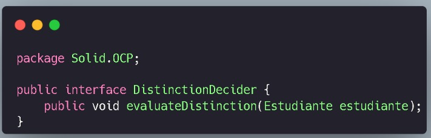

* **Pregunta 9 Completa el código de ArtsDistinctionDecider y ScienceDistinctionDecider que implementan esta interfaz y sobreescriben el método de evaluateDistinction(...) para especificar los criterios de evaluación según sus necesidades. De esta forma, los criterios de distinción específicos de flujo se envuelven en una unidad independiente. Debes tener en cuenta que el método de evaluateDistinction(...) acepta un parámetro Estudiante. Significa que ahora también puede pasar un objeto ArtsStudent o un objeto ScienceStudent a este método. El código restante es fácil y no debería tener ningún problema para comprender la siguiente demostración ahora.**
>Código de la clase ArtsDistinctionDecider:
>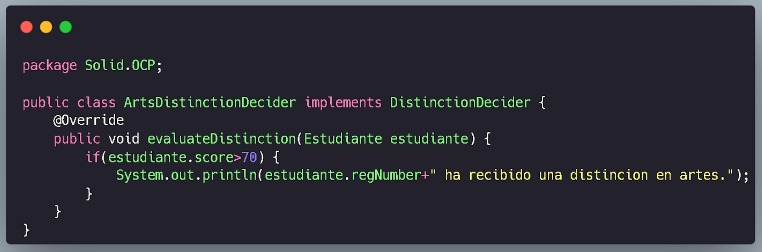

>Código de la clase ScienceDistinctionDecider:
>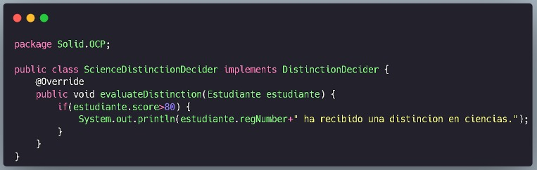

* **Pregunta 10 Realiza una demostración completa que sigue a OCP. Explica tus resultados.**

    **Estudiante.java**

    **ArteEstudiante.java**

    **CienciaEstudiante.java**

    **DistinctionDecider.java**

    **ScienceDistinctionDecider.java**

    **ArtsDistinctionDecider.java**

    **Cliente.java**

>La clase Estudiante es una clase abstracta que instancia objetos de la clase Estudiante. 
>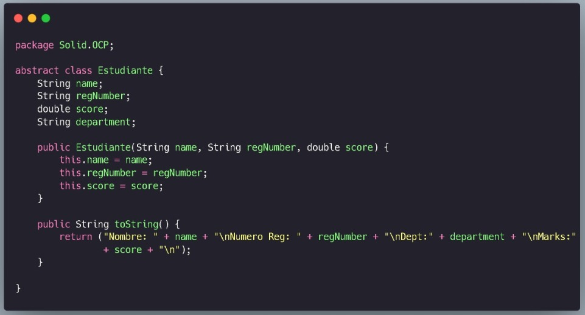
>La clase ArteEstudiante hereda la clase Estudiante. 
>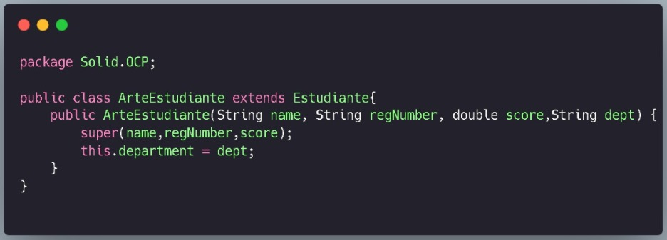
>La clase CienciaEstudiante hereda la clase Estudiante. 
>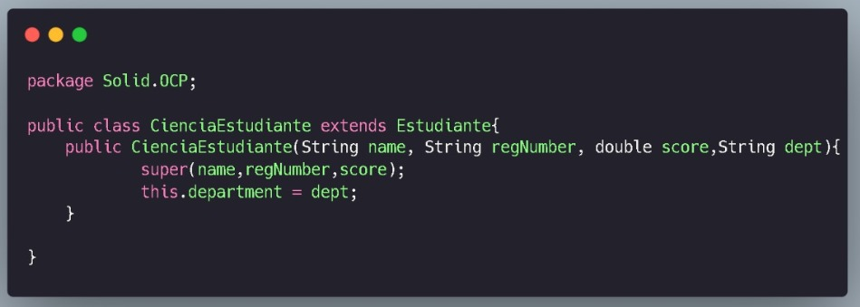
>DistinctionDecider es una interfaz pública que tiene el método evaluateDistinction que recibe como parámetro el objeto estudiante de clase Estudiante. 
>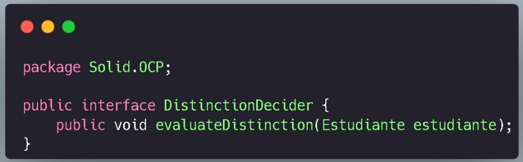
>La clase ScienceDistinctionDecider implementa la interfaz DistinctionDecider, tiene al método evaluateDistintion que recibe como parámetro el objeto estudiante de la clase Estudiante, aquí se evalúa si el puntaje del estudiante de ciencias es mayor a 80 para que sea merecedor de una distinción. 
>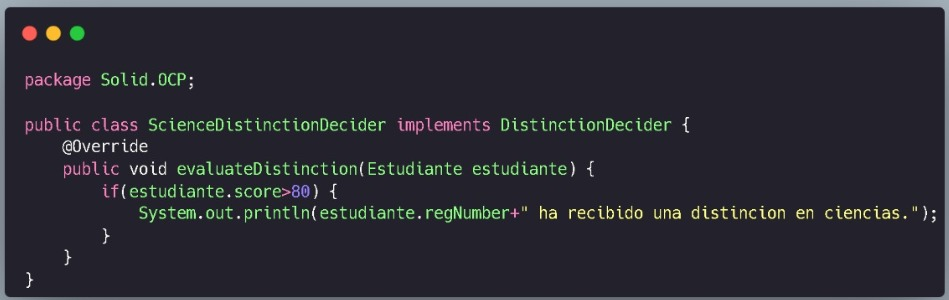
>La clase ArtsDistinctionDecider implementa la interfaz DistinctionDecider, tiene al métdo evaluateDistintion que recibe como parámetro el objeto estudiante de la clase Estudiante, aquí se evalúa si el puntaje del estudiante de artes es mayor a 60 para que sea merecedor de una distinción. 
>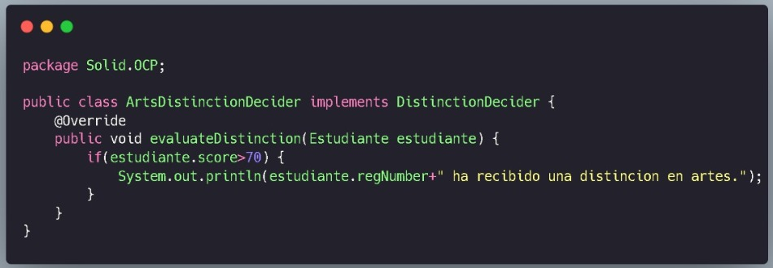
>En la clase Cliente se crean listas para los diferentes tipos de estudiantes y sus corrientes, en este caso una lista para los estudiantes de Ciencias y otra lista para los estudiantes de Arte.
```java
public class Cliente {
    public static void main(String[] args) {
        System.out.println("Demostracion OCP");
        List<Estudiante> CienciasEstudiantes = enrollScienceStudents();
        List<Estudiante> ArtesEstudiantes = enrollArtsStudents();

        // Muestra todos los resultados.
        System.out.println("Resultados:");

        for (Estudiante estudiante : CienciasEstudiantes) {
            System.out.println(estudiante);
        }
        for (Estudiante estudiante : ArtesEstudiantes) {
            System.out.println(estudiante);
        }

        // Evalua las distinciones

        DistinctionDecider scienceDistinctionDecider = new ScienceDistinctionDecider();
        DistinctionDecider artsDistinctionDecider = new ArtsDistinctionDecider();
        System.out.println("Distinciones:");
        for (Estudiante estudiante : CienciasEstudiantes) {
            scienceDistinctionDecider.evaluateDistinction(estudiante);
        }
        for (Estudiante estudiante : ArtesEstudiantes) {
            artsDistinctionDecider.evaluateDistinction(estudiante);
        }

    }

    private static List<Estudiante> enrollScienceStudents() {
        Estudiante Irene = new CienciaEstudiante("Irene", "R1", 81.5,"Ciencia de la computacion.");
        Estudiante jessica = new CienciaEstudiante("Jessica", "R2", 72,"Fisica");
        List<Estudiante> CienciasEstudiantes = new ArrayList<Estudiante>();
        CienciasEstudiantes.add(Irene);
        CienciasEstudiantes.add(jessica);
        return CienciasEstudiantes;
    }

    private static List<Estudiante> enrollArtsStudents() {
        Estudiante chalo = new ArteEstudiante("Chalo", "R3", 71,"Historia");
        Estudiante claudio = new ArteEstudiante("Claudio", "R4", 66.5,"Literatura");
        List<Estudiante> ArtesEstudiantes = new ArrayList<Estudiante>();
        ArtesEstudiantes.add(chalo);
        ArtesEstudiantes.add(claudio);
        return ArtesEstudiantes;
    }


}

```
>Cómo se puede ver ahora si cumple el principio de OCP ya que tanto las clase ArteEstudiante y la claseCienciaEstudiante se extienden de una misma clase por lo cuál se puede añadir nuevo código, pero manteniendo el código base.

* **Pregunta 11 ¿Cuáles son las principales ventajas ahora?**

>Una de las ventajas principales es que ahora se cumple con el principio de Abierto cerrado con lo cual podemos agregar más tipos de corrientes sin la necesidad de modificar el código base solo extendiendo de la clase abstracta Estudiante. Esto debido a que ahora se cuenta con una clase en particular para cada corriente que se tenga. De modo que si se desea agregar una nueva corriente, simplemente se hace la creación de una nueva clase la cual hereda de la clase Estudiante para luego pasar a definirla. Ahora bien, al momento de hacer las nuevas distinciones para esta nueva corriente solo se tendrá que implementar la interfaz DistinctionDecider para implementar la forma en que se distinguirá cada estudiante.

## Principio de sustitución de Liskov (Sofía Poma)

* **Pregunta 12 Muestra la salida y explica los resultados en función de los métodos entregados**

>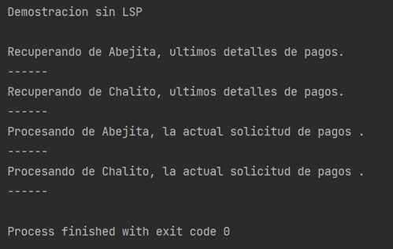

>Tenemos una clase principal, que es la clase Cliente. la cual cuenta con el método main. Primero se imprime un mensaje diciendo que se hará una demostración sin LSP. Luego, se instancia un objeto helper de la clase PaymentHelper (Aquí se guardarán a los ayudantes). Una vez creado este objeto, se instancia dos objetos de la clase RegisteredUserPayment, estos vendrían a ser los usuarios registrados, en este caso sería Abejita y Chalito, estos usuarios también se agregan a helper, luego se procesa el pago usando la clase PaymentHelper llamando a los métodos showPreviousPayments y ProcessNewPayment.
>La clase RegisteredUserPayment cuenta con el atributo name, el constructor y los métodos previusPaymentInfo, el cual hace uso del atributo name imprimiendo un mensaje diciendo que está recuperando los últimos pagos de un ayudante; y newPayment, el cual también hace uso de name imprimiendo un mensaje diciendo que está procesando la actual solicitud de pago.
>Tenemos la interfaz Payment en dónde se encuentran los métodos previousePaymentInfo y newPayment. En la clase PaymentHelper se crea una lista Payment, en esta clase también encontraremos a  los métodos adduser, showPreviousPayments y el método processNewPayments. El método showPreviousPayments hace uso del método previousePaymentInfo de la interfaz y el método processNewPayment hace uso del método newPayment de la interfaz, y usando un for recorremos  cada uno de los elementos de la lista Payment, en cada iteración el elemento hace un llamado al método newPayment, lo mismo ocurre en el método previousPaymentInfo solo que en esta caso en cada interación hace un llamado al método previousPaymentInfo


* **Pregunta 13 Ahora supongamos que tienes un nuevo requisito que dice que necesitas admitir usuarios invitados en el futuro. Puedes procesar la solicitud de pago de un usuario invitado, pero no muestra su último detalle de pago. Entonces, crea la siguiente clase que implementa la interfaz de pago de la siguiente manera:**

```java
public class GuestUserPayment implements Payment{
    String name;
    public GuestUserPayment() {
        this.name = "guest";
    }
    @Override
    public void previousPaymentInfo(){
        throw new UnsupportedOperationException();
    }
    @Override
    public void newPayment(){
        System.out.println("Procesando de "+name+ "pago actual request.");
    }
}

```
* **Pregunta 14 Dentro del método main(), utilizas una instancia de usuario invitado e intentas usar su clase auxiliar de la misma manera,¿ qué tipo de excepción te encuentras?¿Cuál es la solución?**

>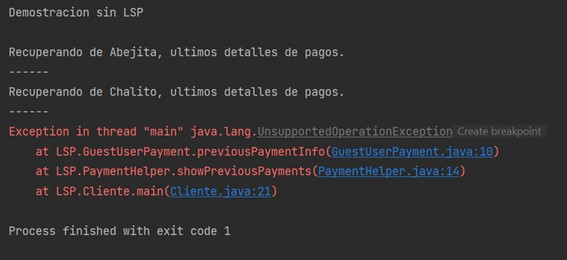

>Se puede observar en la salida que la ejecución del código está correcta hasta que tiene que imprimir el último pago para el ayudante instanciado con la clase GuestUserPayment. Esto debido a que en dicha clase está sobrescrito el método previusPaymentInfo, el cual crea y lanza una excepción del tipo UnsupportedOperationException. Dicha excepción es la responsable de que el código no continúe con la ejecución normal.
>Una solución es que en lugar de crear y lanzar una excepción, se imprima un mensaje de “error” que exprese que no es posible realizar esta operación para este tipo de usuario.

* **Pregunta 15 Todo lo anterior Lo más importante es que viola el OCP cada vez que modifica una clase existente que usa esta cadena if-else. Entonces, busquemos una mejor solución.**

>En el caso de que se desea agregar un tipo nuevo de pago (Payment), se tendría que cambiar la interfaz para ajustar a los requerimientos del nuevo tipo de pago, a su vez también se tendrá que cambiar la clase PaymentHelper,más precisamente su método showPreviusPayment, ya que dicha clase implementa esta interfaz (Payment). Violando así el OCP ya que al estar abierto a nuevas implementaciones, se tendrá que realizar cambiar en algunas partes del código que no deberian (no es cerrado).

* **Pregunta 16 En el próximo programa, eliminaremos el método newPayment() de la interfaz de payment. Coloca este método en otra interfaz llamada NewPayment. Como resultado, ahora tienes dos interfaces con las operaciones específicas. Dado que todos los tipos de usuarios pueden generar una nueva solicitud de pago, las clases concretas de RegisteredUserPayment y GuestUserPayment implementan la interfaz NewPayment. Pero muestra el último detalle de pago solo para los usuarios registrados. Entonces, la clase RegisteredUser implementa la interfaz payment. Dado que Payment contiene el método previousPaymentInfo(), tiene sentido elegir un nombre mejor, como PreviousPayment en lugar de Payment. Entonces, ahora verá las siguientes interfaces:**

```java
interface PreviousPayment {
    void previousPaymentInfo();
}
interface NewPayment {
    void newPayment();
}
```
**Ajuste estos nuevos nombres en la clase auxiliar también. En sección del código debes tener los siguientes archivos:**

**PreviousPayment.java**

**NewPayment.java**

**RegisteredUserPayment.java**

**GuestUserPayment.java**

**PaymentHelper.java**

**Cliente.java**

>La nueva interfaz NewPayment y la interfaz PreviousPayment ahora serán:

```java
interface NewPayment {
    void newPayment();
}
```
```java
interface PreviousPayment {
    void previousPaymentInfo();
}
```
>Por lo que ahora las clases RegisteredUserPayment, GuestUserPayment y la ejecución del código serán:
```java
public class RegisteredUserPayment implements NewPayment,PreviousPayment {
    String name;
    public RegisteredUserPayment(String userName) {
        this.name = userName;
    }
    @Override
    public void previousPaymentInfo(){
        System.out.println("Recuperando de "+ name+ ", ultimos detalles de pagos.");
    }

    @Override
    public void newPayment(){
        System.out.println("Procesando de "+name+", la actual solicitud de pagos .");

    }

}
```
```java
public class GuestUserPayment implements NewPayment{
    String name;
    public GuestUserPayment(){
        this.name = "guest";
    }
    @Override
    public void newPayment(){
        System.out.println("Procesando de " + name + "pago actual request.");
    }
}
```
>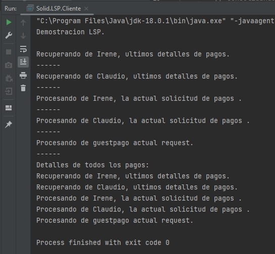


## Pregunta 26
Muestra la salida y explica los resultados en función de los métodos entregados.

Salida:

>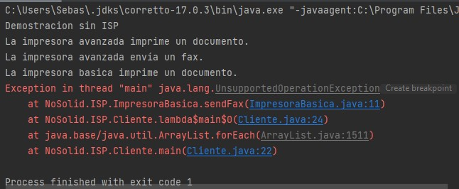

La impresora avanzada cumple ambas funcionalidades correctamente.
Mientras la impresora basica solo imprime documentos pero no puede enviar fax porque
el método sendFax() de ImpresoraBasica está desarrollado para que lance una excepcion
en tiempo de ejecución.

## Pregunta 27
Para terminar esta pregunta, en la sección de SOLID del código entregado, completa los
siguientes archivos. No olvides explicar tus resultados.

Impresora.java:
```java
interface Impresora {
    void printDocument();
}
```
DispositivoFax.java:
```java
interface DispositivoFax {
   void sendFax();
}
```
ImpresoraBasica.java:
```java
public class ImpresoraBasica implements Impresora{
    @Override
    public void printDocument() {
        System.out.println("La impresora básica imprime un documento.");
    }
}
```
ImpresoraAvanzada.java:
```java
public class ImpresoraAvanzada implements Impresora, DispositivoFax{
    @Override
    public void printDocument() {
        System.out.println("La impresora avanzada imprime un documento.");
    }

    @Override
    public void sendFax() {
        System.out.println("La impresora avanzada envía un fax.");
    }
}
```
Cliente.java:
```java
public class Cliente {
    public static void main(String[] args) {
        System.out.println("Demostracion ISP");

        Impresora impresora = new ImpresoraBasica();
        impresora.printDocument();
        impresora = new ImpresoraAvanzada();
        impresora.printDocument();

        DispositivoFax fax = new ImpresoraAvanzada();
        fax.sendFax();

    }
}
```
Salida:

>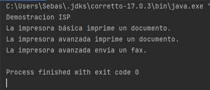

Esta nueva implementacion de las dos impresoras a partir de dos
interfaces separadas (DispositivoFax e Impresora) permiten que
las clases ImpresoraAvanzada e ImpresoraBasica solo implementen
los metodos que realmente usan (ISP).

## Pregunta 28
¿Qué sucede si usa un método predeterminado dentro de la interfaz?

Las clases que implementen este método no tendrian necesidad de
desarrollarla, solo la sobreescribirian si necesitan modificarla para un uso
especifico.

## Pregunta 29
¿Qué sucede si proporcionas un método de fax predeterminado en una interfaz?.

La clase ImpresoraAvanzada podría implementar la funcion sendFax, sin necesidad
de desarrollarla.

El problema es que hay veces que vas a querer implementar una interfaz
en una clase que estés desarrollando, pero estarías implementando
métodos que tal vez no necesita tu clase.

## Pregunta 30
¿Qué sucede si usa un método vacío, en lugar de lanzar la excepción?

ImpresoraBasica.java:
```java
class ImpresoraBasica implements Impresora {
    @Override
    public void printDocument() {
        System.out.println("La impresora basica imprime un documento.");
    }

    @Override
    public void sendFax() {
        //throw new UnsupportedOperationException();
    }
}
```
Salida:

>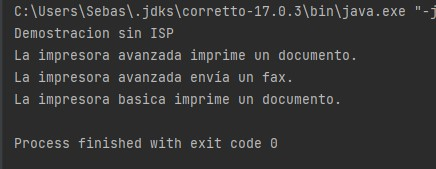

Vemos que se ejecuta sin errores.

## Principio de Inversion de Dependencias (Sebastian Segundo)

## Pregunta 31
Salida:

>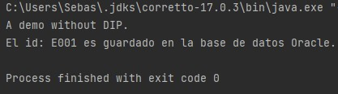

Esta salida se debe a que el cliente hace uso del método
saveEmployeeId() de interfazUsuario.java que a su vez invoca
al método saveEmpIdInDatabase() de OracleDatabase.java para poder guardar datos
de empleados en la BD.

## Pregunta 32
El programa es simple, pero ¿qué tipo de problemas presenta?

Este programa viola el principio de Inversion de Dependencia(DIP),
pues una clase concreta de alto nivel (InterfazUsuario) no debe
depender de una clase concreta de bajo nivel (OracleDatabase).

El código que viola este principio puede acoplarse demasiado,
y eso hace que el código sea difícil de mantener, ilegible, incluso
más difícil de probar.

También viola el principio de Abierto-Cerrado(OCP) porque
si el cliente quiere usar otro tipo de BD se tendria que
modificar la clase OracleDatabase o crear otra.

De esta forma, el programa se convierte en un programa frágil,
impredecible y no reutilizable.

## Pregunta 33
InterfazUsuario.java
```java
class InterfazUsuario {
    private BaseDatos bd;

    public InterfazUsuario(BaseDatos bd) {
        this.bd = bd;
    }
    public void saveEmployeeId(String empId) {
        bd.saveEmpIdInDatabase(empId);
    }
}
```
## Pregunta 34
Completa todos los archivos siguientes de la sección SOLID:

BaseDatos.java
```java
interface BaseDatos {
    public void saveEmpIdInDatabase(String empId);
}
```
OracleDatabase.java
```java
class OracleDatabase implements BaseDatos {
    public void saveEmpIdInDatabase(String empId) {
        System.out.println("El id: " + empId + " es guardado en la base de datos Oracle.");
    }
}
```
MySQLDatabase.java
```java
class MySQLDatabase implements BaseDatos {
    public void saveEmpIdInDatabase(String empId) {
        System.out.println("El id: " + empId + " es guardado en la base de datos MySQL.");
    }
}
```
Cliente.java
```java
public class Cliente {
    public static void main(String[] args) {
        System.out.println("Demostracion con DIP");
        InterfazUsuario usuario;
        // Usando Oracle
        usuario = new InterfazUsuario(new OracleDatabase());
        usuario.saveEmployeeId("E001");

        // Usando Mysql
        usuario = new InterfazUsuario(new MySQLDatabase());
        usuario.saveEmployeeId("E001");

        // Cambiando la base de datos objetivo
        //usuario = new InterfazUsuario(new OracleDatabase());

    }
}
```
Explica los resultados. ¿El programa resuelve todos los posibles problemas del programa que
no usa DIP?

>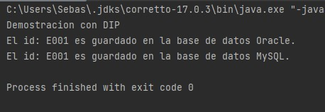

Sí los resuelve, pues ahora el cliente puede registrar usuarios en distintas
BD, gracias a que tanto el módulo de alto nivel (InterfazUsuario)
y los módulos de bajo nivel (MySQLDatabase, OracleDatabase) dependen de la
abstraccion BaseDatos (Principio DIP).

Lo que permite implementar nuevas clases de base de datos
en el código sin modificar las ya existentes (Principo OCP).

De esta manera, se ha reducido el alto acoplamiento que habia
al principio, lo que hace que el código sea más entendible, testeable
y reutilizable.

## Pregunta 35

## Pregunta 36
El constructor de la clase InterfazUsuario acepta un parámetro de base de datos.
Proporciona una instalación adicional a un usuario cuando utiliza tanto el constructor como el
método setter (setDatabase) dentro de esta clase. ¿Cuál es el beneficio?.

```java
class InterfazUsuario {
    private BaseDatos bd;

    public InterfazUsuario(BaseDatos bd) {
        this.bd = bd;
    }
    public void saveEmployeeId(String empId) {
        bd.saveEmpIdInDatabase(empId);
    }
    public void setBd(BaseDatos bd) {
        this.bd = bd;
    }
}
```
El beneficio es que este método nos permite que una
vez inicializada la variable usuario de tipo InterfazUsuario
podemos modificar el tipo de BD que queremos utilizar sin necesidad
de instanciar la variable de nuevo.

```java
public class Cliente {
    public static void main(String[] args) {
        System.out.println("Demostracion con DIP");
        InterfazUsuario usuario;
        // Usando Oracle
        usuario = new InterfazUsuario(new OracleDatabase());
        usuario.saveEmployeeId("E001");

        // Usando Mysql
        usuario = new InterfazUsuario(new MySQLDatabase());
        usuario.saveEmployeeId("E001");

        // Cambiando la base de datos objetivo
        usuario.setBd(new OracleDatabase());
        usuario.saveEmployeeId("E001");

    }
}
```