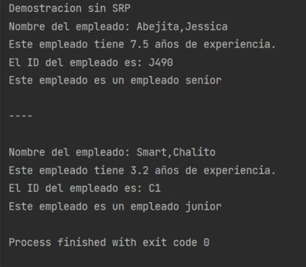
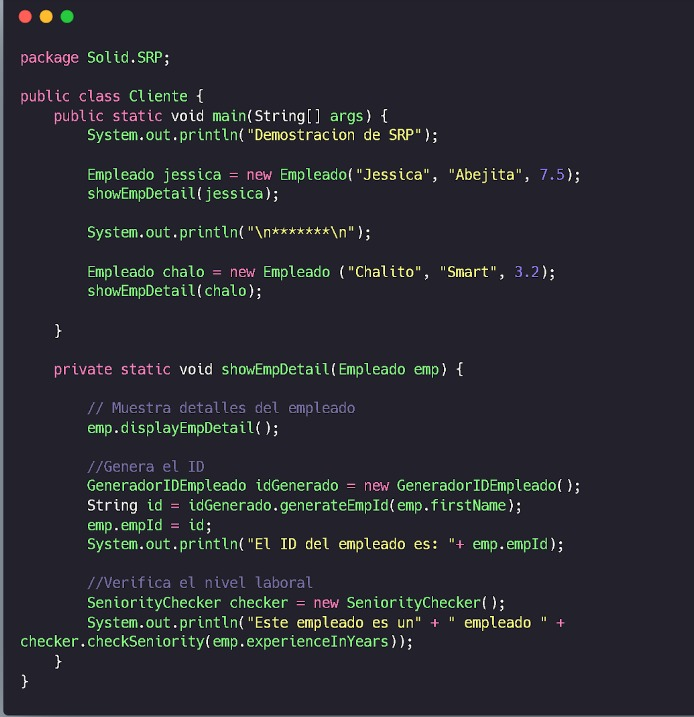
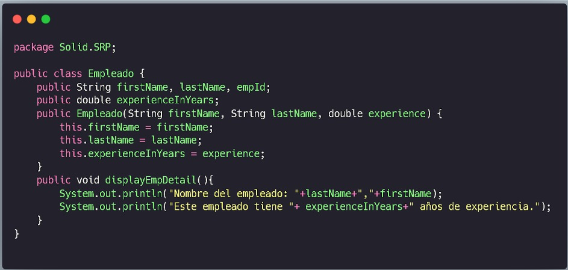
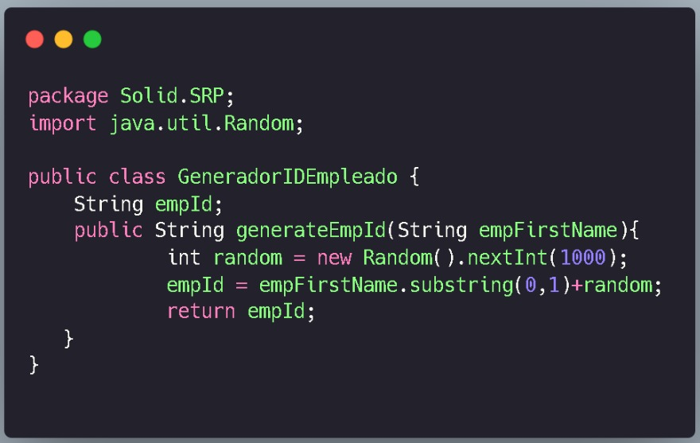
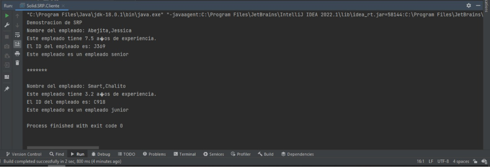

<h1 align="center"> Práctica Califica 3 </h1>

## Principio de responsabilidad única

* **Pregunta 1 Muestra la salida y explica los resultados en función de los métodos entregados**

> 

> En principio se tienen 2 clases, la clase Cliente y la clase Estudiante.
>Al momento de ejecutar el código, se llama al “main” que se encuentra en la clase Cliente. Comienza por imprimir que haremos una demostración sin SRP, luego se instancia un objeto de la clase Empleado, llamando a su constructor el cual se le pasará el nombre, apellido y los años de experiencia. Llamamos al método showEmpDetail de la clase Cliente,  al cual le pasamos por parámetro el objeto Empleado instanciado. Este método hace uso del objeto pasado como parámetro llamando al método displayEmpDetail, el cual imprime el nombre, apellido y los años de experiencia del empleado. A continuación imprime el ID del empleado llamando al método generateEmpId de la clase Empleado, al cual se le pasa por parámetro el nombre del empleado con la finalidad de que nos genere el ID del empleado concatenado la primera letra de su nombre con un número entero random menor que 1000 para así pasar a imprimirlo. Después, se imprime el nivel laboral del empleado llamando al método checkSenior de la clase Empleado, al cual se le pasa por parámetro los años de experiencia del empleado con la finalidad de que evalúe que si los años de experiencia son mayores a 5 entonces será de senior, caso contrario será un junior. Continuando con el main, hace un impresión de un separador denotado por simbolos “-”, para luego volver a instanciar otro objeto de tipo Empleado pasándole sus respectivos datos para finalmente volver a llamar al método displayEmpDetail, el cual ya ha sido detallado anteriormente. Concluyendo así la ejecución del programa.

* **Pregunta 2 ¿Cuál es el problema con este diseño y las razones posibles del problema?**

>El problema con este diseño es que viola el principio de responsabilidad única ya que como se puede observar la clase Empleado tiene 3 responsabilidades distintas, el método displayEmpDetail(), el método checkSeniority, el método generateEmpId, cada una de estos métodos tiene diferentes finalidades lo que provoca un alto acoplamiento y una baja cohesión, lo que hace que nuestro diseño sea frágil. Si quisiéramos, por ejemplo, imprimir los detalles del empleado de manera distinta, no podríamos debido a que solo contamos con un método print. Otro problema sería que si quisiéramos testear el método que verifica la experiencia en años del empleado, estamos obligados a testear los otros métodos también. Es por esto que una posible solución es mover este método a una sola clase la cual se encargará de tener todos los métodos de impresión.

* **Pregunta 3 Modifica la clase Empleado. Agrega dos clases SeniorityChecker que contiene el
método checkSeniority() y la clase GeneradorIDEmpleado contiene el método
generateEmpId(...) para generar la identificación del empleado.
Para mejorar la legibilidad del código y evitar torpezas dentro del método main(), utiliza el
método estático showEmpDetail(...). Este método llama al método displayEmpDetail() de
Empleado, al método generateEmpId() de GeneradorIDEmpleado y al método checkSeniority()
de SeniorityChecker. Tú entiendes que este método no era necesario, pero hace que el código
del cliente sea simple y fácilmente comprensible.**

>

>

>

* **Pregunta 4 Realiza una demostración completa que sigue a SRP. Explica tus resultados 
        Empleado.java

        GeneradorIdEmpleado.java

        SeniorityChecker.java

        Cliente.java**

>

>La clase Cliente tiene el método main en el cuál se instancia un objeto de la clase Empleado y se llama al método showEmpDetail()
>La clase Empleado tiene al método displayEmpDetail() el cual nos mostrará el nombre y el tiempo de experiencia del empleado.
>La clase SeniorityChecker, tiene el método checkSeniority el cuál haciendo uso del atributo experienceInYears evaluará si los años de experiencia del empleado son suficientes para considerarlo junior o senior, será considerado senior si los años de experiencia son mayores a 5 años.
>La clase GeneradorIdEmpleado tiene el método generateEmpId nos generará aleatoriamente el Id del empleado concatenando la primera letra de su nombre con un número aleatorio entre 1000 números enteros.
